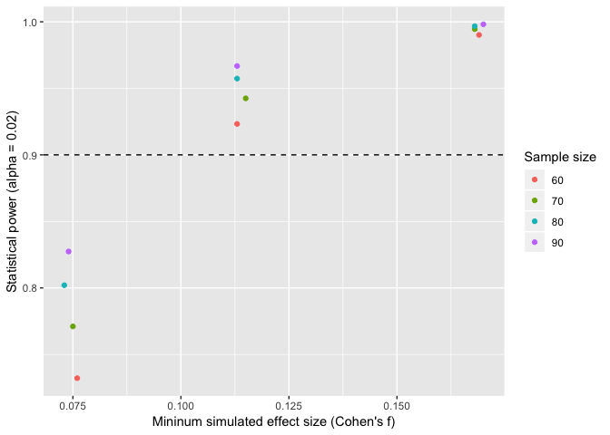

Power simulations for sensitivity analyses (Umemoto et al. preregistered report)
================

``` r
library(data.table); library(hausekeep); library(tidyverse)
```

Simulations
-----------

We simulated 3888 different parameter combinations for our linear mixed model `y ~ b0 + b1x + b2x + error`. For each set of parameter combination, we simulated 1000 datasets and fitted the models using the `lmer()` function from the `lme4` package and obtained the significance values using the `lmerTest` package. Therefore, we ran 3888 \* 1000 = 3888000 models in total. For each test, we determine whether the probability value was equal to or smaller than 0.02 (&gt; 0.02 coded as 0, &lt;= 0.02 coded as 1). These simulations were run using the package `paramtest`.

Simulated random-intercept model: `lmer(y ~ x + y + (1 | subject)`

Since the raw simulated data are nearly 1GB in size, we did not upload them here. We instead provide only the aggregated dataset whereby each row reflects the aggregated values/estimates from 1000 simulations using the same set of parameters.

Data key

-   `N.test`: simulated sample size (60, 70, 80, 90)
-   `b1.test`: simulated b1 coefficients (0.05, 0.08, 0.12)
-   `b2.test`: simulated b1 coefficients (0.05, 0.08, 0.12)
-   `varInt.test`: simulated variance in intercept b0 across participants (0.01, 0.05, 0.10)
-   `varSlope_b1.test`: simulated variance in b1 across participants (0.01, 0.05, 0.10)
-   `varSlope_b2.test`: simulated variance in b2 across participants (0.01, 0.05, 0.10)
-   `varResid.test`: simulated residual variance (0.01, 0.10, 0.20, 0.30)
-   `power_b1`: observed power (1000 simulations) (alpha = 0.02)
-   `power_b2`: observed power (1000 simulations) (alpha = 0.02)
-   `r_x1`: mean observed effect size correlation r (1000 simulations)
-   `r_x2`: mean observed effect size correlation r (1000 simulations)

### Read data

``` r
dt1 <- fread("power_simulations_avg.csv")
print(dt1)
```

    ##       N.test b1.test b2.test varInt.test varSlope_b1.test varSlope_b2.test
    ##    1:     60    0.05    0.05        0.01             0.01             0.01
    ##    2:     60    0.05    0.05        0.01             0.01             0.01
    ##    3:     60    0.05    0.05        0.01             0.01             0.01
    ##    4:     60    0.05    0.05        0.01             0.01             0.01
    ##    5:     60    0.05    0.05        0.01             0.01             0.05
    ##   ---                                                                     
    ## 3884:     90    0.12    0.12        0.10             0.10             0.05
    ## 3885:     90    0.12    0.12        0.10             0.10             0.10
    ## 3886:     90    0.12    0.12        0.10             0.10             0.10
    ## 3887:     90    0.12    0.12        0.10             0.10             0.10
    ## 3888:     90    0.12    0.12        0.10             0.10             0.10
    ##       varResid.test power_b1 power_b2       r_x1      r_x2
    ##    1:          0.01    0.997    1.000 0.26377711 0.3243745
    ##    2:          0.10    0.961    0.984 0.15388313 0.1915666
    ##    3:          0.20    0.895    0.954 0.11872109 0.1491087
    ##    4:          0.30    0.788    0.887 0.09887684 0.1225584
    ##    5:          0.01    0.992    0.868 0.15865483 0.1970839
    ##   ---                                                     
    ## 3884:          0.30    0.988    1.000 0.18297907 0.2301396
    ## 3885:          0.01    0.997    0.999 0.22454385 0.2812703
    ## 3886:          0.10    0.995    0.995 0.20578258 0.2503023
    ## 3887:          0.20    0.991    0.997 0.18736653 0.2325196
    ## 3888:          0.30    0.985    0.995 0.16987899 0.2146853

### Compute minimum observed power

``` r
avg <- dt1[, .(min_r_x1 = min(r_x1),
        min_r_x2 = min(r_x2),
        pow_b1 = mean(power_b1),
        pow_b2 = mean(power_b2)),
    keyby = .(N.test, b1.test)]
# convert correlation r to Cohen's f and print result
avg[, f := es(r = min_r_x1, msg = F)$f, by = .(N.test, b1.test)] %>% print()
```

    ##     N.test b1.test   min_r_x1   min_r_x2    pow_b1    pow_b2     f
    ##  1:     60    0.05 0.07625368 0.09577780 0.7321574 0.9180247 0.076
    ##  2:     60    0.08 0.11240932 0.09736109 0.9232623 0.9189414 0.113
    ##  3:     60    0.12 0.16699638 0.09730276 0.9901296 0.9177685 0.169
    ##  4:     70    0.05 0.07456797 0.09386761 0.7710679 0.9325154 0.075
    ##  5:     70    0.08 0.11376271 0.09531727 0.9424630 0.9324660 0.115
    ##  6:     70    0.12 0.16562002 0.09593202 0.9945093 0.9330648 0.168
    ##  7:     80    0.05 0.07298579 0.09624433 0.8020216 0.9435247 0.073
    ##  8:     80    0.08 0.11211197 0.09268520 0.9573333 0.9442901 0.113
    ##  9:     80    0.12 0.16543589 0.09431878 0.9967037 0.9439321 0.168
    ## 10:     90    0.05 0.07338928 0.09356151 0.8273642 0.9526883 0.074
    ## 11:     90    0.08 0.11188563 0.09409394 0.9667901 0.9523179 0.113
    ## 12:     90    0.12 0.16786409 0.09164078 0.9981111 0.9523364 0.170

### Plot

``` r
ggplot(avg, aes(f, pow_b1, col = as.factor(N.test))) +
  geom_point() +
  # geom_line() +
  geom_hline(yintercept = 0.90, linetype = 'dashed') +
  labs(x = "Mininum simulated effect size (Cohen's f)", y = "Statistical power (alpha = 0.02)", col = "Sample size")
```



``` r
# ggsave("simulations.jpg", dpi = 200, width = 7, height = 5)
```
